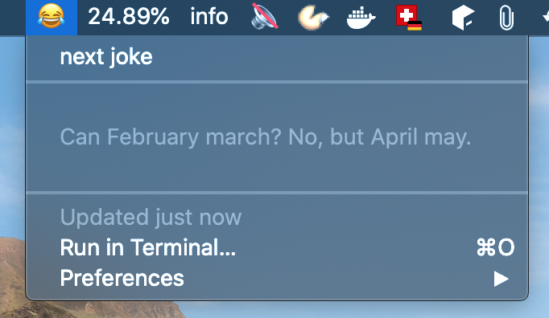

# xbar-dadjokes-plugin
A xbar plugin which tells you random dad jokes

## Installation
1. Install [xbar](https://xbarapp.com/)
2. Download `dadjokes.5m.sh` and put it into your plugin directory
3. Ensure the plugin is executable by running `chmod +x dadjokes.5m.sh`
4. If you would like to change the refresh rate visit https://github.com/matryer/xbar#configure-the-refresh-time
5. Finally choose `Refresh all` from the xbar menu

## License
MIT © [Simon Peier](https://github.com/simonpeier)
